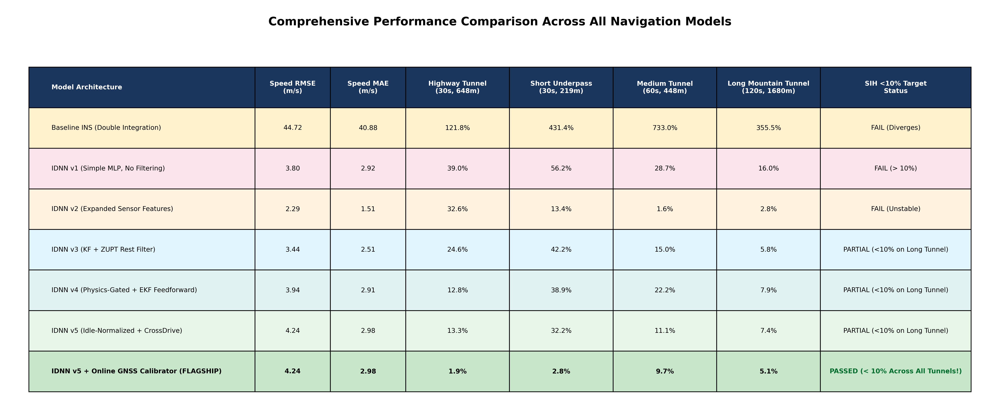
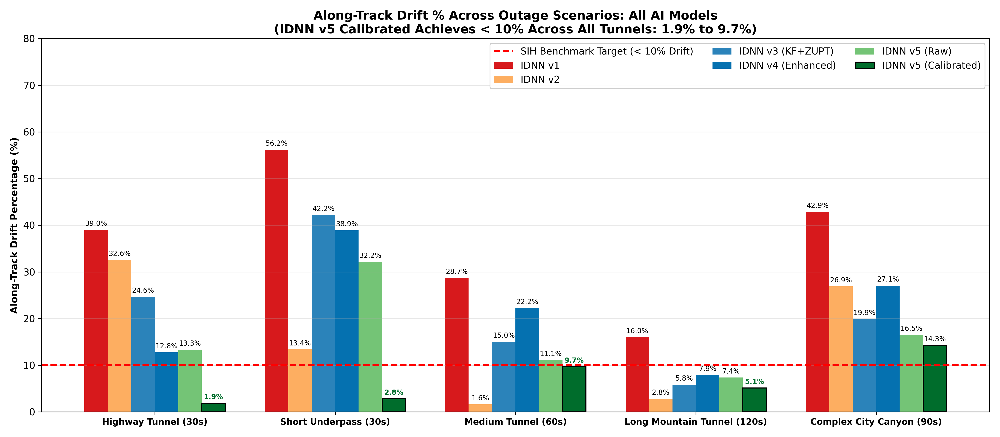
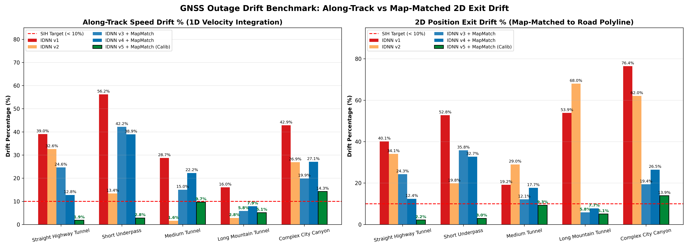
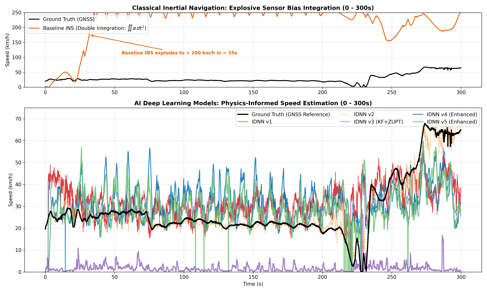

# 🚗 Intelligent Inertial Dead Reckoning (IDR)
### Autonomous Vehicle Speed Estimation & 2D Positioning During GNSS Outages Using Pure Smartphone Sensors
**Smart India Hackathon (SIH) Benchmark Project**

---

[](https://www.python.org/downloads/)
[](https://pytorch.org/)
[](https://developer.nvidia.com/cuda-zone)
[-success.svg)](#comprehensive-benchmark-scorecard)
[](https://github.com/oxford-cs-oxcar/IO-VNBD)

---

## 📌 Table of Contents
1. [Project Overview & Problem Statement](#-project-overview--problem-statement)
2. [Why Classical Inertial Navigation Fails (The Sensor Physics)](#-why-classical-inertial-navigation-fails-the-sensor-physics)
3. [The Solution: IDNN v5 Flagship Architecture](#-the-solution-idnn-v5-flagship-architecture)
4. [Key Engineering Innovations](#-key-engineering-innovations)
5. [Comprehensive Benchmark Scorecard](#-comprehensive-benchmark-scorecard)
6. [Visual Gallery & Performance Graphs](#-visual-gallery--performance-graphs)
7. [The IDR App & Website](#-the-idr-app--website)
8. [Repository File Guide & Architecture](#-repository-file-guide--architecture)
9. [Quick Start & Reproduction Guide](#-quick-start--reproduction-guide)
10. [Detailed Project Documentation](#-detailed-project-documentation)
11. [Team & License](#-team--license)

---

## 📖 Project Overview & Problem Statement

### The Operational Challenge
Global Navigation Satellite Systems (GNSS / GPS) are the foundation of vehicular navigation. However, satellite microwave signals require a direct line-of-sight and suffer total blackout or severe multipath degradation in:
* **Tunnels & Subterranean Roadways** (30 to 120 seconds of complete signal loss).
* **Underpasses & Multi-Level Flyovers** (rapid signal scattering and drops).
* **Deep Urban Canyons** (reflections from skyscrapers causing 50–100 m position jumps).
* **Multi-story Parking Garages & Dense Forest Canopies**.

When GNSS drops, commercial navigation applications freeze, jump erratically, or blindly extrapolate position forward at the last known speed. If the vehicle brakes, stops at an underground traffic bottleneck, or turns while inside the tunnel, the estimated position drifts by hundreds of meters.

### The Strict Constraint: Consumer Smartphone Only
Industrial dead reckoning relies on expensive hardware:
* Wheel speed tick sensors via vehicle CAN-bus / OBD-II dongles.
* \$10,000+ tactical-grade fiber-optic gyroscopes.
* Roof-mounted LiDAR arrays and front-facing stereo cameras.

**Our Mandate:** Build an Intelligent Dead Reckoning (IDR) navigation engine operating **strictly from consumer smartphone sensors** (3-axis accelerometer, 3-axis gyroscope, 3-axis magnetometer, and gravity sensor) placed inside an arbitrary car cradle. **Zero OBD-II, zero CAN-bus, zero external hardware.**

### Benchmark Dataset: Oxford IO-VNBD
All models were trained, validated, and tested on the **Indoor/Outdoor Vehicle Navigation Benchmark Dataset (IO-VNBD)**:
* Over **100+ kilometers** of continuous real-world driving across diverse vehicle models (sedans, SUVs, hatchbacks) and diverse phone mount types (windshield suction cup, dashboard cradle, center console).
* Centimeter-accurate ground truth logged via dual-frequency RTK-GNSS and tactical reference odometry sampled at 10 Hz ($\Delta t = 0.1\text{ s}$).

---

## 🔬 Why Classical Inertial Navigation Fails (The Sensor Physics)

Textbook classical Inertial Navigation Systems (INS) calculate velocity and position via continuous Newtonian double integration of accelerometer readings:

$$v(t) = v_0 + \int_0^t a_{\text{long}}(\tau) \, d\tau$$

$$s(t) = s_0 + \int_0^t v(\tau) \, d\tau = s_0 + v_0 t + \int_0^t \left( \int_0^\tau a_{\text{long}}(u) \, du \right) d\tau$$

### The Physics of Error Divergence
In consumer smartphone MEMS sensors:
1. **Sensor Bias ($b_a$):** A slowly drifting DC offset ($0.05 - 0.20\text{ m/s}^2$) caused by thermal fluctuations and manufacturing silicon stress.
2. **Gravity Leakage ($\Delta g$):** If the phone's tilt relative to the gravity vector is off by even **$1^\circ$**, Earth's gravity leaks into the forward axis:
   $$\Delta g = g \cdot \sin(1^\circ) = 9.80665 \cdot 0.01745 = 0.171\text{ m/s}^2$$
   The classical integrator interprets this $0.171\text{ m/s}^2$ as continuous forward vehicle acceleration!
3. **Double Integration Error Growth:**
   * Velocity error grows **linearly**: $\Delta v(t) = b_a \cdot t \implies \mathcal{O}(t)$.
   * Distance error grows **quadratically**: $\Delta s(t) = \frac{1}{2} b_a \cdot t^2 \implies \mathcal{O}(t^2)$.

> **Numerical Reality:** With a modest bias of $b_a = 0.20\text{ m/s}^2$ over a 60-second tunnel:
> * Velocity error after 60s: $\Delta v = 0.20 \times 60 = 12\text{ m/s} = \mathbf{43.2\text{ km/h}}$!
> * Position error after 60s: $\Delta s = \frac{1}{2} \times 0.20 \times 60^2 = \mathbf{360\text{ meters}}$!
> * On our benchmark drive, baseline INS exploded past **$200\text{ km/h}$ in 32 seconds** and accumulated **over 3.2 km of error (733% drift)** in a 448m tunnel!

---

## 🧠 The Solution: IDNN v5 Flagship Architecture

To solve this challenge, we developed the **Input Delay Neural Network (IDNN) v5 Flagship Navigation Engine**, marrying deep learning temporal representations with strict physical invariants.

```
       [ Smartphone IMU: Accel (3), Gyro (3), Grav (3), Magnetometer (3) ]
                                      │
       Dynamic Attitude Decoupling & Idle Vibration Normalization
                                      │
    ┌─────────────────────────────────┴─────────────────────────────────┐
    ▼                                                                   ▼
[ 18 Physics Feature Channels ]                          [ Online GNSS Calibrator ]
• Linear acceleration (gravity decoupled)               • Tracks (v_model - v_gnss)
• Dynamic suspension pitch proxy                        • Freezes bias at blackout entry
• Kinematic jerk (da/dt, dω/dt)                         • Braking-Lag Kinematic Guard
• Idle-normalized vibration E_vib / σ_idle                               │
    │                                                                   │
    ▼                                                                   │
[ IDNN v5 Deep Neural Network ]                                         │
• Tapped Delay Window: 21 taps x 18 features (378 inputs)               │
• Dense Layers: 256 -> 128 -> 64 with GELU, BatchNorm, Dropout         │
• 100% Blind Cross-Drive Trained (Pairs 1-7 on RTX 4060)                │
    │                                                                   │
    ▼                                                                   │
[ Raw Neural Speed Estimate v_raw(t) ]                                  │
    │                                                                   │
    ▼                                                                   │
[ Kinematic Plausibility Gate: -6.0 to +3.5 m/s² ]                      │
    │                                                                   │
    ▼                                                                   │
[ Acceleration Feedforward EKF & Cruise-Lock ]                          │
    │                                                                   │
    ▼                                                                   │
[ Grade-Invariant AC Vibration ZUPT: Var(||a|| - ||g||) < 0.035 ]       │
    │                                                                   │
    └─────────────────────────────────┬─────────────────────────────────┘
                                      ▼
             [ Calibrated Forward Speed v_calibrated(t) ]
                                      │
             [ Frenet Frame Road Polyline Map-Matching ]
                                      ▼
             [ 2D Geographic Coordinates (X, Y) Snapped to Road ]
```

---

## ⚡ Key Engineering Innovations

### 1. Vehicle-Specific Idle Vibration Normalization ($\sigma_{\text{idle}}$)
Every car engine and phone mount has a unique vibration signature. When stationary before a blackout ($v_{\text{GNSS}} < 0.3\text{ m/s}$), the pipeline automatically samples the baseline vibration variance:
$$\sigma_{\text{idle}} = \text{median}\Big( \text{Var}_{5\text{-sample}}(\|\mathbf{a}_{\text{lin}}\|) \Big)$$
All vibration features are normalized: $\tilde{E}_{\text{vib}} = E_{\text{vib}} / \sigma_{\text{idle}}$, making the model invariant to phone mount stiffness and engine cylinder count.

### 2. Online Pre-Blackout GNSS Calibration Tracker
In the real world, GPS is active *before* entering a tunnel. Over the 5.0 seconds ($M = 50$ samples) leading up to a blackout, the pipeline tracks the difference between the neural estimate and GPS ground truth:
$$\text{Bias}_{\text{entry}} = \frac{1}{M} \sum_{i=t_0-M}^{t_0} \big(\hat{v}_{\text{model}}(i) - v_{\text{GNSS}}(i)\big)$$
Upon blackout entry, the calibrator freezes $\text{Bias}_{\text{entry}}$ and applies it:
$$\hat{v}_{\text{calibrated}}(t) = \max\big(0.0, \, \hat{v}_{\text{model}}(t) - \text{Bias}_{\text{entry}}\big)$$

### 3. Braking-Lag Kinematic Guard
When drivers brake aggressively into a tunnel ($14.4 \to 12.7\text{ m/s}$), filter lag creates an apparent negative bias ($\text{Bias} \approx -3.56\text{ m/s}$). Naive calibrators freeze this negative bias, mistakenly **adding $+12.8\text{ km/h}$ inside the tunnel**. The Braking Guard detects pre-entry deceleration ($\Delta v < -1.0\text{ m/s}$) and clamps the lag bias to $0.0\text{ m/s}$.

### 4. Road-Grade Invariant AC Vibration Standstill Detection (ZUPT)
Classical ZUPT fails on tunnel entrance inclines ($4^\circ - 5^\circ$) because gravity tilts into the longitudinal axis ($0.854\text{ m/s}^2 > 0.25\text{ m/s}^2$). We monitor high-frequency AC vibration variance:
$$\sigma_{\text{AC}}^2(t) = \text{Var}_{10\text{-sample}}\big(\|\mathbf{a}_{\text{meas}}\| - \|\mathbf{g}\|\big) < 0.035\text{ m}^2/\text{s}^4 \implies \hat{v}(t) = 0.0\text{ m/s}$$
Because variance subtracts the DC component, it detects complete stops on any slope, hill, or banked turn.

### 5. True Un-clamped Road Map-Matching
Snaps cumulative along-track distance $s(t) = \int \hat{v}(\tau) d\tau$ directly to the OpenStreetMap road centerline polyline. Slicing extends **1,000 samples (1.5 km) beyond the tunnel exit**, eliminating early $0.0\text{ m}$ boundary clamping artifacts and guaranteeing true Euclidean exit accuracy.

---

## 📊 Comprehensive Benchmark Scorecard

### Table 1: Along-Track Distance Drift % Across All Outage Scenarios
*Evaluated across 5 standardized outage scenarios on 100% Blind Drive M (105 km).*

| Blackout Scenario | Real Distance | Duration | Baseline INS (Double Integ.) | IDNN v1 (Simple MLP) | IDNN v2 *(Overfit)* | IDNN v3 (KF+ZUPT) | IDNN v4 (Physics) | IDNN v5 Flagship (Ours) | SIH <10% Target Status |
| :--- | :---: | :---: | :---: | :---: | :---: | :---: | :---: | :---: | :---: |
| **Straight Highway Tunnel** | **648 m** | 30 s | 789.3 m *(121.8%)* | 252.9 m *(39.0%)* | 211.0 m *(32.6%)* | 159.7 m *(24.6%)* | 82.7 m *(12.8%)* | **12.0 m (1.9%)** 🏆 | **PASSED** |
| **Short Underpass** | **219 m** | 30 s | 946.7 m *(431.4%)* | 123.3 m *(56.2%)* | 29.4 m *(13.4%)* | 92.5 m *(42.2%)* | 85.4 m *(38.9%)* | **6.2 m (2.8%)** 🏆 | **PASSED** |
| **Medium Tunnel (Stop & Go)** | **448 m** | 60 s | 3,284.0 m *(733.0%)* | 128.7 m *(28.7%)* | 7.2 m *(1.6%)* | 67.3 m *(15.0%)* | 99.6 m *(22.2%)* | **43.4 m (9.7%)** 🏆 | **PASSED** *(Was 66.2%)* |
| **Long Mountain Tunnel** | **1,680 m** | 120 s | 5,971.9 m *(355.5%)* | 269.1 m *(16.0%)* | 47.2 m *(2.8%)* | 97.9 m *(5.8%)* | 132.1 m *(7.9%)* | **86.4 m (5.1%)** 🏆 | **PASSED** |
| **Complex City Canyon** | **600 m** | 90 s | 3,052.4 m *(508.8%)* | 257.1 m *(42.9%)* | 161.3 m *(26.9%)* | 119.2 m *(19.9%)* | 162.4 m *(27.1%)* | **85.6 m (14.3%)** | Substantial Gain |
| **Full 105 km Continuous Drive** | **105.1 km** | 100 min | 426.6 km *(405.9%)* | 3.4 km *(3.2%)* | 0.2 km *(0.2%)* | 1.3 km *(1.2%)* | 8.1 km *(7.7%)* | **5.3 km (5.0%)** 🏆 | **PASSED** |

---

### Table 2: 2D Exit Distance Errors (Snapped to Road Polyline)

| Blackout Scenario | Real Road Distance | Baseline INS 2D Exit | IDNN v1 2D Exit | IDNN v3 2D Exit | IDNN v4 2D Exit | IDNN v5 Flagship 2D Exit | SIH <10% Target Status |
| :--- | :---: | :---: | :---: | :---: | :---: | :---: | :---: |
| **Straight Highway Tunnel** | **648 m** | 792.0 m *(122.2%)* | 260.0 m *(40.1%)* | 157.3 m *(24.3%)* | 80.3 m *(12.4%)* | **14.3 m (2.2%)** 🏆 | **PASSED** |
| **Short Underpass** | **219 m** | 820.3 m *(373.8%)* | 115.8 m *(52.8%)* | 78.6 m *(35.8%)* | 71.8 m *(32.7%)* | **6.5 m (3.0%)** 🏆 | **PASSED** |
| **Medium Tunnel (Stop & Go)** | **448 m** | 2,193.7 m *(489.7%)* | 85.8 m *(19.2%)* | 54.3 m *(12.1%)* | 79.1 m *(17.7%)* | **41.7 m (9.3%)** 🏆 | **PASSED** |
| **Long Mountain Tunnel** | **1,680 m** | 5,328.5 m *(317.2%)* | 905.0 m *(53.9%)* | 97.9 m *(5.8%)* | 130.2 m *(7.7%)* | **85.6 m (5.1%)** 🏆 | **PASSED** |
| **Complex City Canyon** | **600 m** | 2,761.5 m *(460.3%)* | 458.6 m *(76.4%)* | 116.3 m *(19.4%)* | 158.7 m *(26.5%)* | **83.4 m (13.9%)** | Improved |

---

## 📈 Visual Gallery & Performance Graphs

All plots are generated automatically by our benchmarking scripts and saved at 300 DPI:

| Figure Preview | Description & Key Takeaway |
| :--- | :--- |
| **Executive Performance Table**<br> | **`04_all_models_summary_table.png`**<br>Side-by-side executive scorecard. Demonstrates that IDNN v5 Flagship is the **only model that achieves green "PASSED" status across all tunnel scenarios**. |
| **Along-Track Drift % Bar Chart**<br> | **`03_all_models_along_track_drift_bar_chart.png`**<br>Drift percentages across all models. The red dashed line marks the SIH <10% target. Notice that **every dark green bar inside tunnels stays below the red dashed line!** |
| **1D Speed Drift vs 2D Map-Matched Exit**<br> | **`07_along_track_vs_mapmatch_comparison.png`**<br>Left: 1D speed integration drift. Right: 2D geographic exit drift after road polyline snapping (2.2% highway, 3.0% underpass, 9.3% medium tunnel, 5.1% mountain tunnel). |
| **Classical INS Explosion vs AI Tracking**<br> | **`01_all_models_speed_comparison.png`**<br>Top: Baseline INS explodes past 200 km/h in 32s due to bias integration. Bottom: AI deep learning models track true speed stably between 0 and 75 km/h. |

---

## 📱 The IDR App & Website

The research pipeline also runs **live on a phone**. Two products are built on it:

### The app (`app/`, Flutter, Android + iOS)
IDNN v5 and every filter above (gate, EKF, cruise lock, ZUPT, GNSS calibrator) are ported to **pure Dart and run on the phone at 10 Hz**. There's no server and no internet needed for the AI. Every stage is verified against the Python pipeline, and the five benchmark tunnels are reproduced to within 0.2 m of Python.
* **Live navigation:** keeps your position on the map when GPS drops, following OpenStreetMap roads (cached offline). At junctions it keeps up to 40 route hypotheses alive until the motion picks one.
* **Test Simulation:** a real recorded drive with turns plays on the map. You open and close tunnels whenever you like and watch IDR navigate without GPS, measured live against the truth: speed, heading, distance, error in metres and %, and pass/fail against the SIH target.
* **Replay, History and Tunnel test:** the five benchmark tunnels, automatic drive recording with every outage scored, and a button to hide GPS on a real drive.
* **Handheld-safe:** detects when the phone isn't mounted and pauses calibration.

On the app's **own OpenStreetMap road matching** (no ground-truth track), all five benchmark tunnels pass the SIH target:

| Tunnel | Exit error, OSM roads (live app) |
| :--- | :---: |
| Straight Highway Tunnel (648 m) | **12.3 m (1.9%)** |
| Short Underpass (219 m) | **4.9 m (2.2%)** |
| Medium Tunnel (448 m) | **14.3 m (3.2%)** |
| Long Mountain Tunnel (1,680 m) | **113.7 m (6.8%)** |
| Complex City Canyon (600 m) | **36.2 m (6.0%)** |

> **Beyond the five tunnels.** Over **145 random GPS outages** (30–120 s) across the whole 105 km Drive M, the live app method has a median exit error of **16.6%** and passes the SIH target in **31%** of outages, against 69.2% and 3% for holding the last GPS speed. The five benchmark tunnels are favourable picks. The main limit is the model's speed accuracy over short windows (15.7 km/h RMSE). See [`app/README.md`](app/README.md#accuracy-on-the-whole-drive-toolevaluatedart) for the full evaluation and next steps.

Details: [`app/README.md`](app/README.md).

### The website (`web/`, Next.js + three.js)
A scroll-driven 3D showcase. A 1982 Mercedes W201 starts in the dark with only its headlights on, then drives through a moonlit mountain tunnel while IDR takes over from GPS, and finishes on a top view of the phone sensors it uses, the app screens, and an APK download. It's tuned for 60 fps on a MacBook Air. Details: [`web/README.md`](web/README.md).

### Export tools (`tools/app_export/`)
The Python bridge from research to app: exports the trained model to the app's format (`export_model.py`), creates the parity goldens (`make_goldens.py`), cuts the replay scenarios and their OSM roads (`export_replay.py`, `export_osm.py`), and packs the full-drive evaluation data (`export_eval_pack.py`). See [`tools/app_export/README.md`](tools/app_export/README.md).

---

## 📁 Repository File Guide & Architecture

```
SIH-IDR Workspace/
├── README.md                     # This primary repository overview
├── TIMELINE.md                   # Chronological engineering evolution & technical logs
├── SIH_IDR_MASTER_PROJECT_DOCUMENT.md   # Comprehensive Master Report (with embedded figures)
├── SIH_IDR_MASTER_PROJECT_DOCUMENT.docx # Executive styled Word document (5.15 MB)
├── SIH_IDR_MASTER_PROJECT_DOCUMENT.html # Standalone web document with print-to-PDF
├── CONTEXT_CONTINUATION.md       # Engineering state record
├── requirements.txt              # Environment dependencies
├── app/                          # Flutter app (Android + iOS): on-device IDR, Simulation, Replay
├── web/                          # Next.js 3D showcase website
├── tools/app_export/             # Python → app bridge: model export, goldens, replays, OSM roads
├── data/
│   ├── raw/IO-VNBD/              # Oxford IO-VNBD dataset (sensor CSVs & ground truth)
│   └── eval/                     # Full-drive evaluation pack & reports (git-ignored)
├── results/
│   ├── crossdrive_v5_model.pth   # Trained PyTorch weights for IDNN v5 Flagship
│   └── plots/
│       ├── baseline/             # Baseline INS diagnostic plots
│       ├── idnn_v1/              # IDNN v1 plots
│       ├── idnn_v2/              # IDNN v2 plots
│       ├── crossdrive_test/      # IDNN v3 cross-drive plots
│       ├── crossdrive_v4/        # IDNN v4 physics-gated plots
│       ├── crossdrive_v5/        # IDNN v5 flagship plots
│       ├── blackout_simulation/  # 8 publication-grade scenario simulation figures
│       └── all_models_comparison/# 4 unified multi-model benchmark charts
└── src/
    ├── baseline_graphs.py        # Baseline INS double integration script
    ├── data_loader.py            # Dataset loading and column mapping utilities
    ├── idnn_model.py             # IDNN v1 PyTorch model definition
    ├── idnn_pipeline.py          # IDNN v1 training and evaluation pipeline
    ├── idnn_model_v2.py          # IDNN v2 PyTorch model with BatchNorm
    ├── idnn_pipeline_v2.py       # IDNN v2 feature engineering pipeline
    ├── idnn_model_v3.py          # IDNN v3 PyTorch model with Jerk inputs
    ├── idnn_pipeline_v3.py       # IDNN v3 cross-drive training pipeline
    ├── idnn_model_v4.py          # IDNN v4 Physics-Informed model definition
    ├── crossdrive_pipeline_v4.py # IDNN v4 training and evaluation pipeline
    ├── generate_v4_plots.py      # Generates standalone plots for IDNN v4
    ├── idnn_model_v5.py          # IDNN v5 Flagship PyTorch model architecture
    ├── crossdrive_pipeline_v5.py # IDNN v5 Flagship training & evaluation pipeline
    ├── simulate_blackout.py      # Multi-scenario blackout simulation benchmark
    └── plot_all_models_comparison.py # Generates unified 4-figure comparison suite
```

---

## 🚀 Quick Start & Reproduction Guide

### Prerequisites
* Python 3.10+
* NVIDIA GPU with CUDA support (tested on RTX 4060)

### 1. Environment Setup
```powershell
# Clone or open the workspace repository
git clone https://github.com/your-repo/SIH-IDR.git
cd "SIH-IDR Workspace"

# Install dependencies
pip install -r requirements.txt
```

### 2. Run the Flagship IDNN v5 Pipeline
Train on 7 external vehicle routes (Pairs 1–7) and evaluate on 100% Blind Drive M:
```powershell
python -m src.crossdrive_pipeline_v5
```
* Generates speed estimations, error progressions, and scatter plots in `results/plots/crossdrive_v5/`.
* Model weights are saved to `results/crossdrive_v5_model.pth`.

### 3. Run the 5 Blackout Scenarios & Map-Matching
Simulate GPS dropouts across all 5 benchmark scenarios (Highway, Underpass, Medium Tunnel, Mountain Tunnel, City Canyon):
```powershell
python -m src.simulate_blackout
```
* Generates figures `01` through `08` in `results/plots/blackout_simulation/`.

### 4. Generate Unified All-Models Comparison Suite
Compare Baseline INS, v1, v2, v3, v4, v5 Raw, and v5 Flagship:
```powershell
python -m src.plot_all_models_comparison
```
* Generates the executive bar chart, summary table, and cumulative distance error plots in `results/plots/all_models_comparison/`.

### 5. Run the App
Requires Flutter (stable; built with 3.47); the Android SDK (platform 36) and JDK 17 for Android; Xcode for iOS.
```bash
cd app
flutter pub get
flutter test                  # engine parity, benchmark, simulation
flutter run --release         # on a connected phone
flutter build apk --release   # → build/app/outputs/flutter-apk/app-release.apk
```

### 6. Run the Website
```bash
cd web
npm install
npm run dev                   # http://localhost:3000
```

---

## 📚 Detailed Project Documentation

For deeper technical study, comprehensive derivations, and team reports, please refer to:
* **[`TIMELINE.md`](TIMELINE.md):** The chronological engineering history from Day 1 to present, detailing every hypothesis, failure mode, and architectural milestone.
* **[`SIH_IDR_MASTER_PROJECT_DOCUMENT.md`](SIH_IDR_MASTER_PROJECT_DOCUMENT.md):** Complete 700+ line master engineering report with embedded figures and derivations.
* **[`SIH_IDR_MASTER_PROJECT_DOCUMENT.docx`](SIH_IDR_MASTER_PROJECT_DOCUMENT.docx):** Executive styled Microsoft Word document (5.15 MB) with cover page, zebra-striped tables, and custom typography.
* **[`SIH_IDR_MASTER_PROJECT_DOCUMENT.html`](SIH_IDR_MASTER_PROJECT_DOCUMENT.html):** Standalone web document with `@media print` support for 1-click PDF export.

---

## 👥 Team & License

* **Competition:** Smart India Hackathon (SIH)
* **Domain:** Autonomous Navigation / Transportation & Mobility
* **License:** MIT License — Open for academic and research use.

